# TecNM Mapas · Nacional Deportivo Colima

Aplicación Android para orientar a jugadores, delegaciones y visitantes en el campus y las sedes deportivas de Colima. Identidad azul TecNM, fichas de lugares y navegación peatonal.


**[Descargar APK para Android](https://storage.googleapis.com/tecnm-mapas-updates/TecNM_Mapas_v1.1.10_b27.apk)** · [Galería de capturas](docs/screenshots/README.md)

## La app en un Xiaomi real

| Inicio | Mapa del campus | Ficha de un lugar |
|:---:|:---:|:---:|
| 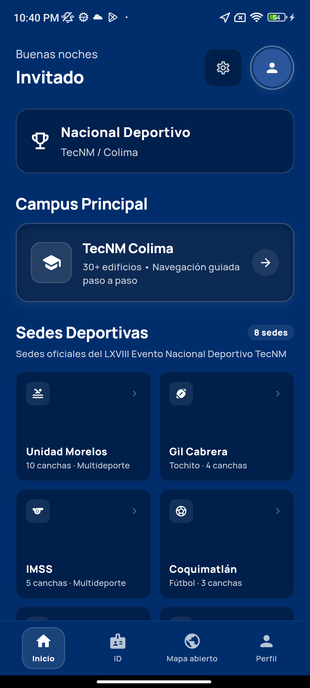 | 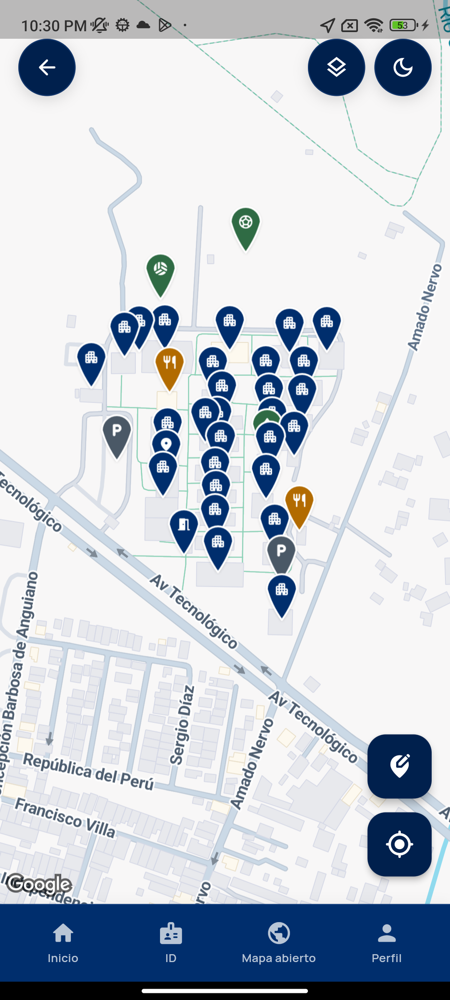 | 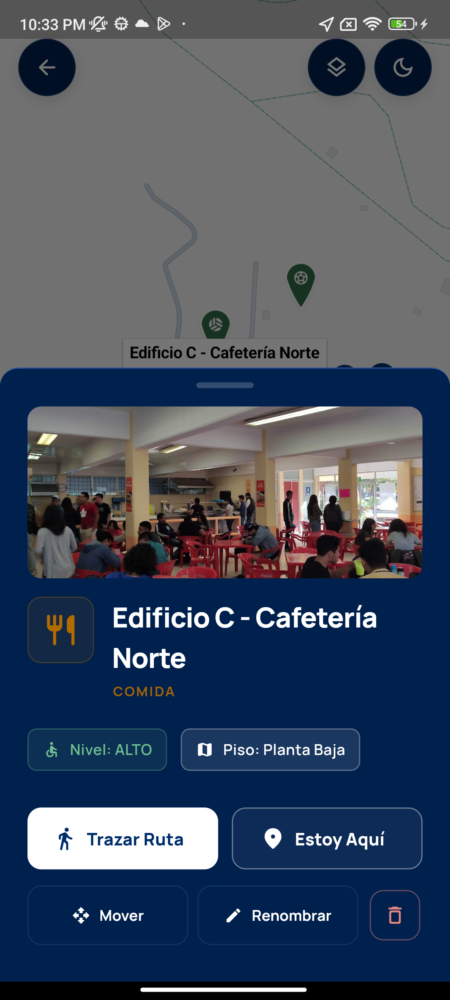 |

| Navegación | Vista satelital | Avisos por color |
|:---:|:---:|:---:|
| 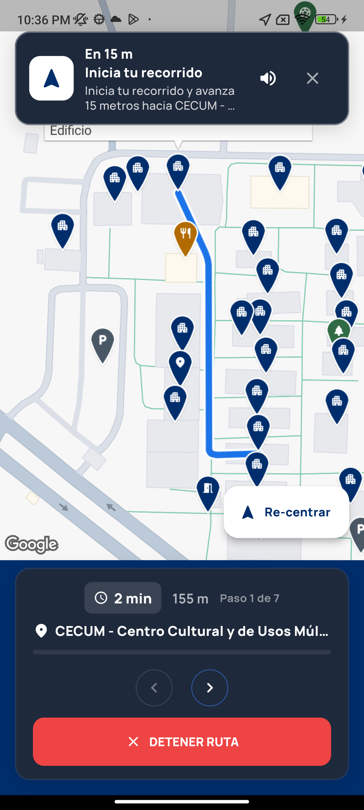 | 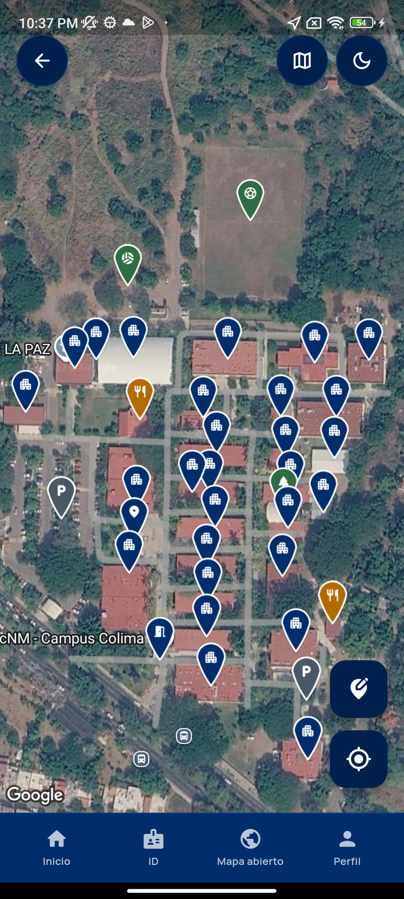 | 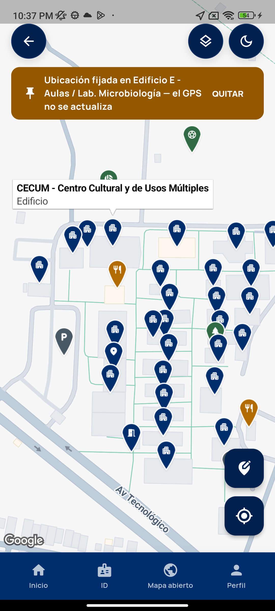 |

| Edición del mapa | Ajustes | Acceso institucional |
|:---:|:---:|:---:|
| 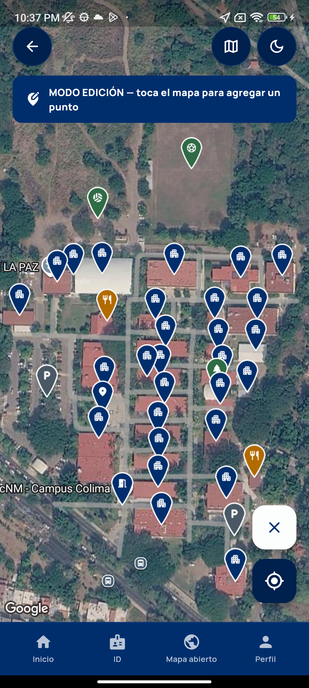 | 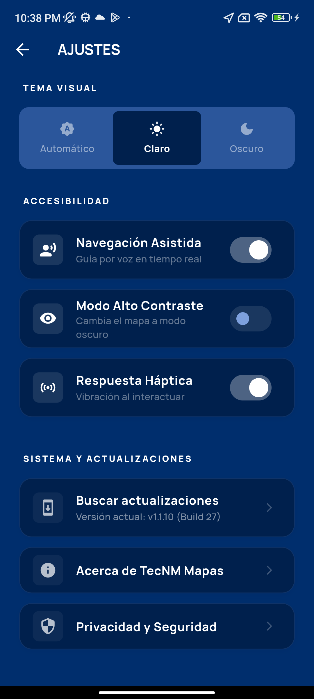 | 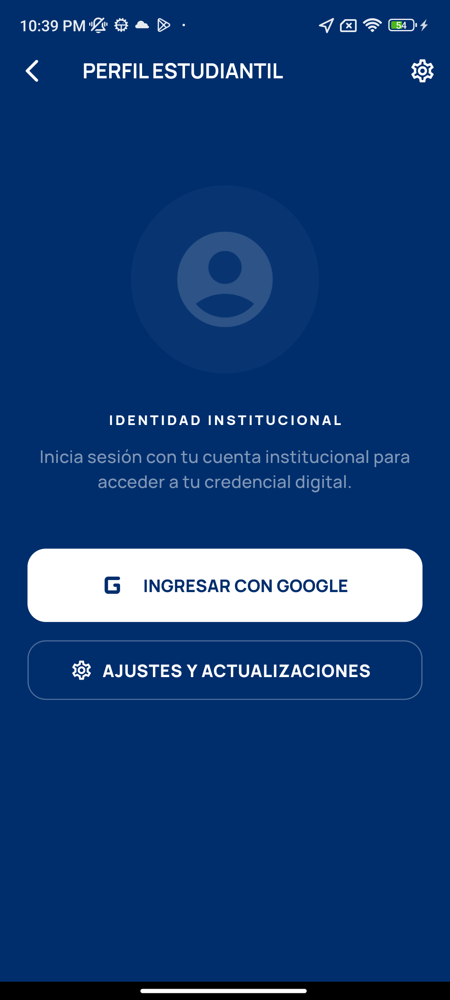 |

| Credencial con sesión | Mapa abierto de Colima | Perfil con sesión |
|:---:|:---:|:---:|
| 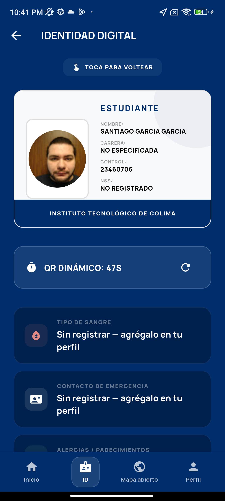 | 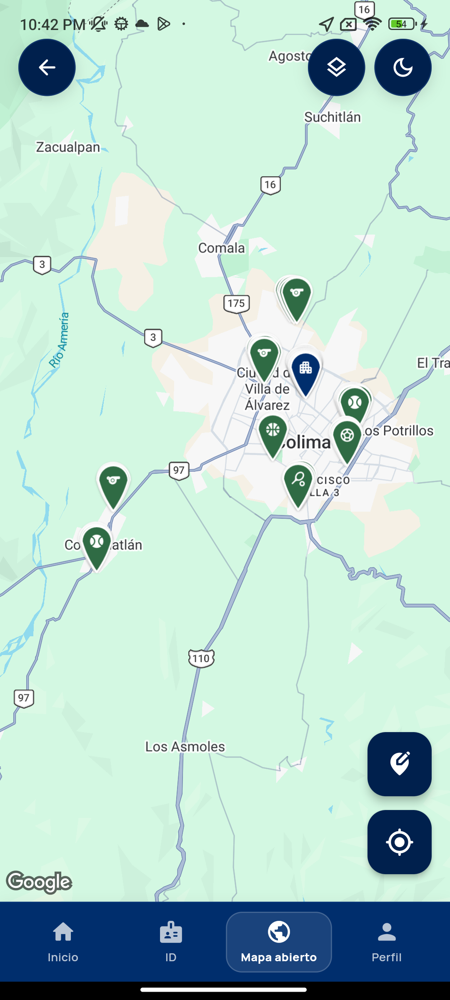 | 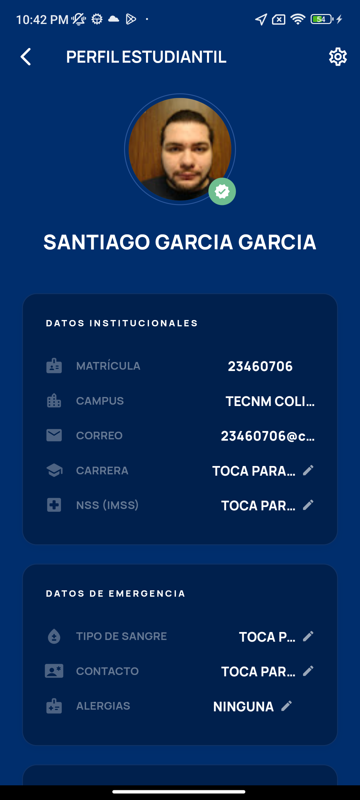 |

## Funciones

- Nueve sedes, puntos de interés y fotografías de instalaciones.
- Mapas de Google con capas y modo claro u oscuro.
- Rutas peatonales sobre los grafos incluidos, filtros de accesibilidad e indicaciones por voz.
- Acceso institucional con Google, perfil y credencial digital.
- Edición de puntos y avisos para administradores.
- Actualizaciones con descarga del APK, progreso y validación del paquete y su versión.

Los grafos incluidos permiten calcular rutas localmente. Las imágenes del mapa, la autenticación, las actualizaciones y la sincronización con la nube requieren conexión. La información disponible depende de cada sede.

## Sedes

TecNM Colima · Unidad Morelos · Gil Cabrera · IMSS · Coquimatlán · Gustavo Vázquez · Sur · UDIF · UD Las Moras.

## Cambios de esta entrega

Los avisos del mapa permanecen en el mapa: verde para éxito, rojo para errores o eliminación, ámbar para advertencias y azul para información. Se ajustaron los controles flotantes y paneles para distintos tamaños de pantalla y texto.

La navegación evita abrir repetidamente la misma pantalla al pulsar un botón. Atrás de Android recorre las pantallas de la app y el inicio cuenta con protección frente a salidas accidentales. Se conserva el diseño azul institucional.

El actualizador consulta la versión instalada de Android y verifica el APK descargado. El despliegue valida paquete, versión y compilación antes de publicar una URL específica para cada entrega.

## Desarrollo

Se necesitan Flutter compatible con las dependencias de `app/pubspec.yaml`, Android SDK y la configuración de Firebase y Google Maps del entorno. Las claves privadas de firma y credenciales de servidor se mantienen fuera del repositorio.

```sh
git clone https://github.com/SantiagoPro1/TecNM-Mapas.git
cd TecNM-Mapas/app
flutter pub get
flutter analyze
flutter test
flutter run
```

Para generar un APK con la configuración de firma local:

```sh
flutter build apk --release
```

El resultado aparece en `app/build/app/outputs/flutter-apk/app-release.apk`. El proceso de publicación está en [scripts/deploy_release.ps1](scripts/deploy_release.ps1); modifica recursos de la nube y necesita la configuración del proyecto de destino.

## Organización y verificación

| Carpeta | Contenido |
|---|---|
| `app/lib/core` | Tema, constantes y navegación |
| `app/lib/data` | Modelos, repositorios y estado |
| `app/lib/presentation` | Pantallas, avisos y controles |
| `app/lib/services` | Rutas, voz y actualizaciones |
| `app/assets` | Grafos, fotografías y recursos del mapa |
| `app/test` | Pruebas de lógica y componentes |
| `backend` | API complementaria |
| `scripts` | Herramientas y despliegue |

La revisión local pasó `flutter analyze` y **174 pruebas**. Se comprueban rutas, datos de sedes, navegación, avisos, diseño adaptable y validación de actualizaciones. Las capturas muestran la app instalada; las pruebas automáticas no garantizan ausencia de errores en todos los dispositivos o condiciones de red.

## Créditos y licencia

Desarrollado por estudiantes del **TecNM Campus Colima** para la comunidad deportiva nacional.

**Santiago G. García** — desarrollo, navegación e infraestructura; colaboradores técnicos y de diseño — interfaz, credencialización y catalogación de sedes.

Este software es propiedad del equipo de desarrollo institucional del **Instituto Tecnológico de Colima (TecNM)**. Todos los derechos reservados.
